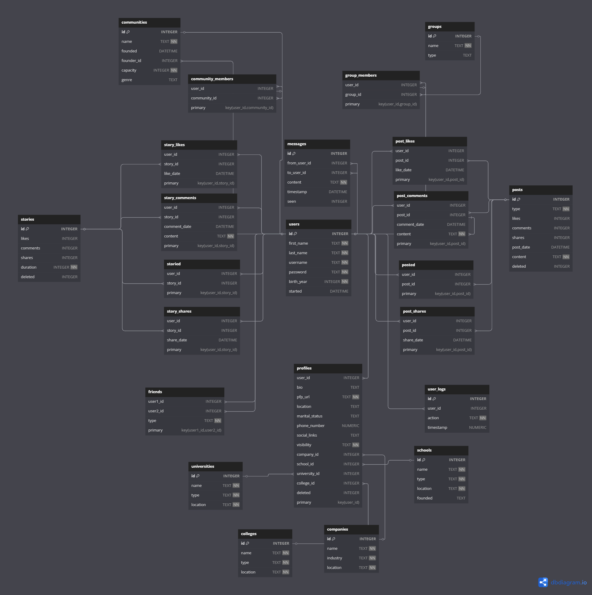

# Design Document

By Abdalrahman Younes

Video overview: [<Video URL>](https://youtu.be/9BjY1k_9Bok?si=H6BVV-BxrCB1m_Fa)

## Scope

* The database of my project represents a simple social media app that has posts, stories, communities, groups, and profiles. It also includes the relationships between users (friends, posts, stories, groups, communities, logs, messages).

* It is designed to collect common data from users, such as which groups or communities they join, what relationships they have on the app, and what post types they like, comment on, or share. The same applies to stories. Additionally, it tracks user logs on the app, monitors messages between users and their contents, allowing developers to control sensitive topics on the app and detect illegal transactions.

* This project is a simplified version of a social media database app. It has many elements out of scope that are needed for more advanced and larger apps, such as a blocking list, reporting list, notifications, email login, logged-in devices, and other privacy and complementary settings.

## Functional Requirements

* A user has access to many features, such as:
  * Posting stories
  * Posting posts
  * Joining communities
  * Joining groups
  * Sharing their school, university, college, or company
  * Liking, commenting, or sharing posts and stories
  * Building their own unique profile
  * Adding friends
  * Sending messages to their friends

In this simplified version of the social app, a user cannot access some complementary features, such as:
* Blocking other users, posts, communities, or groups
* Reporting content.

## Representation

    Entities are represented in SQLite tabkes with 'schema.sql' file.

### Entities

The database includes the follwing entities:

#### Users

The `users` table includes:

* `id`, which specifies the unique ID for each user as an `INTEGER`. This column has the `PRIMARY KEY` constraint, ensuring that each user has a unique identifier.
* `first_name`, which specifies the user's first name as `TEXT`. `TEXT` is used since names are typically represented by strings of characters.
* `last_name`, which specifies the user's last name, also stored as `TEXT` for the same reason as `first_name`.
* `username`, which specifies the user's username as `TEXT`. The `UNIQUE` constraint ensures that no two users can have the same username, making it a unique identifier for users on the app, whick helps me to join tables without needing for ID.
* `password`, which specifies the user's password as `TEXT`. It is important to note that passwords should be hashed for security purposes before being stored, hashing process is applied by backend developer.
* `birth_year`, which specifies the user's year of birth as `INTEGER`. A `CHECK` constraint ensures that the birth year must be greater than 1900 and less than 2025, limiting the possible values to realistic ages.
* `started`, which specifies the date and time the user created their account or started using the app, stored as `DATETIME`. The default value for this column is set to the current timestamp, using `DEFAULT CURRENT_TIMESTAMP`.

This table is essential for storing the fundamental information about users within the social app.

#### Posts

The `posts` table includes:

* `id`, which specifies the unique ID for each post as an `INTEGER`. This column has the `PRIMARY KEY` constraint, ensuring that each post has a unique identifier.
* `type`, which specifies the type of the post as `TEXT`. A `CHECK` constraint ensures that the value of `type` can only be one of the following: 'private', 'public', or 'archived'. The `lower()` function is used to enforce case insensitivity.
* `likes`, which specifies the number of likes on the post as `INTEGER`. The default value is 0, and a `CHECK` constraint ensures that this number cannot be negative (always each post must start with 0 likes **uninsertable column**).
* `comments`, which specifies the number of comments on the post as `INTEGER`. The default value is 0, and a `CHECK` constraint ensures that this number cannot be negative (always each post must start with 0 comments **uninsertable column**)
* `shares`, which specifies the number of shares of the post as `INTEGER`. The default value is 0, and a `CHECK` constraint ensures that this number cannot be negative,
(always each post must start with 0 shares **uninsertable column**).
* `post_date`, which specifies the timestamp when the post was created, stored as `DATETIME`. The default value is set to the current timestamp using `DEFAULT CURRENT_TIMESTAMP`.
* `content`, which specifies the content of the post as `TEXT`. This field stores the actual text or media content the user shares in their post. It is marked as `NOT NULL`, meaning it must contain some data (maybe content is visual, but its content summarized as text).
* `deleted`, which specifies whether the post is deleted, stored as `INTEGER`. It uses a `CHECK` constraint to limit values to either 0 (not deleted) or 1 (deleted), with the default value set to 0 (not deleted), this applies **Soft Deletion** concept.

This table is designed to store information about the posts made by users within the social media app.

#### Posted

The `posted` table represents the relationship between users and posts. It includes:

* `user_id`, which specifies the ID of the user who created the post as an `INTEGER`. This column has a `FOREIGN KEY` constraint that references the `id` column in the `users` table. The `ON DELETE CASCADE` ensures that if a user is deleted, all associated entries in this table will be automatically removed.
* `post_id`, which specifies the ID of the post as an `INTEGER`. This column has a `FOREIGN KEY` constraint that references the `id` column in the `posts` table. The `ON DELETE CASCADE` ensures that if a post is deleted, all associated entries in this table will be automatically removed.
* The combination of `user_id` and `post_id` forms the **PRIMARY KEY**, ensuring that each user-post combination is unique in the table, this helps to avoid **redundent relationships**.

This table is essential for establishing the many-to-many relationship between users and posts in the social app.

#### Post Likes

The `post_likes` table represents the likes of users for posts. It includes:

* `user_id`, which specifies the ID of the user who liked the post as an `INTEGER`. This column has a `FOREIGN KEY` constraint that references the `id` column in the `users` table. The `ON DELETE CASCADE` ensures that if a user is deleted, all associated entries in this table will be automatically removed.
* `post_id`, which specifies the ID of the post that was liked as an `INTEGER`. This column has a `FOREIGN KEY` constraint that references the `id` column in the `posts` table. The `ON DELETE CASCADE` ensures that if a post is deleted, all associated entries in this table will be automatically removed.
* `like_date`, which specifies the date and time when the user liked the post, stored as `DATETIME`. The default value is set to the current timestamp using `DEFAULT CURRENT_TIMESTAMP`.
* The combination of `user_id` and `post_id` forms the **PRIMARY KEY**, ensuring that each user-post like combination is unique, which is resonable, because a user cannot like the same post many times .

#### Post Shares

The `post_shares` table represents the shares of users for posts. It includes:

* `user_id`, which specifies the ID of the user who shared the post as an `INTEGER`. This column has a `FOREIGN KEY` constraint that references the `id` column in the `users` table. The `ON DELETE CASCADE` ensures that if a user is deleted, all associated entries in this table will be automatically removed.
* `post_id`, which specifies the ID of the post that was shared as an `INTEGER`. This column has a `FOREIGN KEY` constraint that references the `id` column in the `posts` table. The `ON DELETE CASCADE` ensures that if a post is deleted, all associated entries in this table will be automatically removed.
* `share_date`, which specifies the date and time when the user shared the post, stored as `DATETIME`. The default value is set to the current timestamp using `DEFAULT CURRENT_TIMESTAMP`.
* The combination of `user_id` and `post_id` forms the **PRIMARY KEY**, ensuring that each user-post share combination is unique, which is resonable, because a user cannot share the same post many times .

#### Post Comments

The `post_comments` table represents the comments of users for posts. It includes:

* `user_id`, which specifies the ID of the user who commented on the post as an `INTEGER`. This column has a `FOREIGN KEY` constraint that references the `id` column in the `users` table. The `ON DELETE CASCADE` ensures that if a user is deleted, all associated entries in this table will be automatically removed.
* `post_id`, which specifies the ID of the post that was commented on as an `INTEGER`. This column has a `FOREIGN KEY` constraint that references the `id` column in the `posts` table. The `ON DELETE CASCADE` ensures that if a post is deleted, all associated entries in this table will be automatically removed.
* `comment_date`, which specifies the date and time when the comment was made, stored as `DATETIME`. The default value is set to the current timestamp using `DEFAULT CURRENT_TIMESTAMP`.
* `content`, which specifies the content of the comment as `TEXT`. The `CHECK(LENGTH("content") > 0)` ensures that the comment content cannot be empty.
* The combination of `user_id` and `post_id` here isn't a **PRIMARY KEY**, because a user can comment on the same post many times.

This table is crucial for storing comments made by users on posts within the social media app.

#### Stories

The `stories` table represents all stories with their interactions in the social app. It includes:

* `id`, which specifies the unique ID for each story as an `INTEGER`. This column has the `PRIMARY KEY` constraint, ensuring that each story has a unique identifier.
* `likes`, which specifies the number of likes for the story as `INTEGER`. The default value is 0, and a `CHECK` constraint ensures that the number of likes cannot be negative, (always each story must start with 0 likes **uninsertable column**).
* `comments`, which specifies the number of comments on the story as `INTEGER`. The default value is 0, and a `CHECK` constraint ensures that the number of comments cannot be negative (always each story must start with 0 comments **uninsertable column**).
* `shares`, which specifies the number of shares of the story as `INTEGER`. The default value is 0, and a `CHECK` constraint ensures that the number of shares cannot be negative (always each story must start with 0 shares **uninsertable column**).
* `duration`, which specifies the duration for which the story is visible, stored as `INTEGER`. A `CHECK` constraint ensures that the value is between 0 and 24 hours.
* `deleted`, which specifies whether the story is deleted, stored as `INTEGER`. It uses a `CHECK` constraint to limit values to either 0 (not deleted) or 1 (deleted), with the default value set to 0 (not deleted), which applies **Soft Deletion** concept.

#### Storied

The `storied` table represents the relationship between users and stories. It includes:

* `user_id`, which specifies the ID of the user who created the story as an `INTEGER`. This column has a `FOREIGN KEY` constraint that references the `id` column in the `users` table. The `ON DELETE CASCADE` ensures that if a user is deleted, all associated entries in this table will be automatically removed.
* `story_id`, which specifies the ID of the story as an `INTEGER`. This column has a `FOREIGN KEY` constraint that references the `id` column in the `stories` table. The `ON DELETE CASCADE` ensures that if a story is deleted, all associated entries in this table will be automatically removed.
* The combination of `user_id` and `story_id` forms the **PRIMARY KEY**, ensuring that each user-story combination is unique in the table, this helps to avoid **redundent relationships**.

#### Story Likes

The `story_likes` table represents the likes of users for stories. It includes:

* `user_id`, which specifies the ID of the user who liked the story as an `INTEGER`. This column has a `FOREIGN KEY` constraint that references the `id` column in the `users` table. The `ON DELETE CASCADE` ensures that if a user is deleted, all associated entries in this table will be automatically removed.
* `story_id`, which specifies the ID of the story that was liked as an `INTEGER`. This column has a `FOREIGN KEY` constraint that references the `id` column in the `stories` table. The `ON DELETE CASCADE` ensures that if a story is deleted, all associated entries in this table will be automatically removed.
* `like_date`, which specifies the date and time when the user liked the story, stored as `DATETIME`. The default value is set to the current timestamp using `DEFAULT CURRENT_TIMESTAMP`.
* The combination of `user_id` and `story_id` forms the **PRIMARY KEY**, ensuring that each user-story like combination is unique, which is resonable, because a user cannot like the same story many times .

#### Story Shares

The `story_shares` table represents the shares of users for stories. It includes:

* `user_id`, which specifies the ID of the user who shared the story as an `INTEGER`. This column has a `FOREIGN KEY` constraint that references the `id` column in the `users` table. The `ON DELETE CASCADE` ensures that if a user is deleted, all associated entries in this table will be automatically removed.
* `story_id`, which specifies the ID of the story that was shared as an `INTEGER`. This column has a `FOREIGN KEY` constraint that references the `id` column in the `stories` table. The `ON DELETE CASCADE` ensures that if a story is deleted, all associated entries in this table will be automatically removed.
* `share_date`, which specifies the date and time when the user shared the story, stored as `DATETIME`. The default value is set to the current timestamp using `DEFAULT CURRENT_TIMESTAMP`.
* The combination of `user_id` and `story_id` forms the **PRIMARY KEY**, ensuring that each user-story share combination is unique, which is resonable, because a user cannot share the same story many times .

#### Story Comments

The `story_comments` table represents the comments of users for stories. It includes:

* `user_id`, which specifies the ID of the user who commented on the story as an `INTEGER`. This column has a `FOREIGN KEY` constraint that references the `id` column in the `users` table. The `ON DELETE CASCADE` ensures that if a user is deleted, all associated entries in this table will be automatically removed.
* `story_id`, which specifies the ID of the story that was commented on as an `INTEGER`. This column has a `FOREIGN KEY` constraint that references the `id` column in the `stories` table. The `ON DELETE CASCADE` ensures that if a story is deleted, all associated entries in this table will be automatically removed.
* `comment_date`, which specifies the date and time when the comment was made, stored as `DATETIME`. The default value is set to the current timestamp using `DEFAULT CURRENT_TIMESTAMP`.
* `content`, which specifies the content of the comment as `TEXT`. The `CHECK(LENGTH("content") > 0)` ensures that the comment content cannot be empty.
* The combination of `user_id` and `story_id` here isn't a **PRIMARY KEY**, because a user can comment on the same story many times.

This table is crucial for storing comments made by users on stories within the social media app.

#### Communities

The `communities` table represents all the communities on the social app. It includes:

* `id`, which specifies the unique ID for each community as an `INTEGER`. This column has the `PRIMARY KEY` constraint, ensuring that each community has a unique identifier.
* `name`, which specifies the name of the community as `TEXT`. This column has the `UNIQUE` constraint to ensure that no two communities have the same name, and the `NOT NULL` constraint to require a name for every community.
* `founded`, which specifies the timestamp of when the community was founded, stored as `DATETIME`. The default value is set to the current timestamp using `DEFAULT CURRENT_TIMESTAMP`. If no timestamp is provided, it will automatically be populated with the time of the community’s creation.
* `founder_id`, which specifies the ID of the user who founded the community as an `INTEGER`. This column has a `FOREIGN KEY` constraint that references the `id` column in the `users` table. The `ON DELETE CASCADE` ensures that if the user who founded the community is deleted, all associated communities founded by that user will also be automatically removed from the database.
* `capacity`, which specifies the maximum number of members that the community can have as an `INTEGER`. A `CHECK` constraint ensures that the capacity value must always be greater than 1, preventing communities with invalid or zero capacity.
* `genre`, which specifies the genre or type of community as `TEXT`. The default value is set to 'General' if no genre is specified, allowing the creation of general-purpose communities.

This table is essential for storing all the community information on the app, ensuring each community is unique and properly defined.

#### Community Members

The `community_members` table represents the relationship between users and the communities they join. It includes:

* `user_id`, which specifies the ID of the user who joined the community as an `INTEGER`. This column has a `FOREIGN KEY` constraint that references the `id` column in the `users` table. The `ON DELETE CASCADE` ensures that if a user is deleted, all the community memberships associated with that user will also be automatically removed.
* `community_id`, which specifies the ID of the community the user has joined as an `INTEGER`. This column has a `FOREIGN KEY` constraint that references the `id` column in the `communities` table. The `ON DELETE CASCADE` ensures that if a community is deleted, all the memberships for that community will be automatically removed as well.
* The combination of `user_id` and `community_id` forms the **PRIMARY KEY**, ensuring that each membership is unique. This is important because a user can only join a community once, and any attempt to duplicate a user-community pair will result in an error.

This table serves as the bridge between users and the communities they are part of, allowing users to be linked with multiple communities.

#### Groups

The `groups` table represents all the groups on the social app. It includes:

* `id`, which specifies the unique ID for each group as an `INTEGER`. This column has the `PRIMARY KEY` constraint, ensuring that each group has a unique identifier.
* `name`, which specifies the name of the group as `TEXT`. This column has the `UNIQUE` constraint to ensure that no two groups have the same name, and the `NOT NULL` constraint to require that every group has a name.
* `type`, which specifies the type of the group as `TEXT`. It can either be 'private' or 'public', and the default value is set to 'private'. The `CHECK` constraint ensures that the value is restricted to one of the two valid types. The `lower()` function is used to make the comparison case-insensitive, so values like 'Private' and 'private' are treated as equivalent.

This table is crucial for storing all group data, helping to define the various types of groups that can exist within the app.

#### Group Members

The `group_members` table represents the relationship between users and the groups they join. It includes:

* `user_id`, which specifies the ID of the user who joined the group as an `INTEGER`. This column has a `FOREIGN KEY` constraint that references the `id` column in the `users` table. The `ON DELETE CASCADE` ensures that if a user is deleted, all their group memberships will also be deleted.
* `group_id`, which specifies the ID of the group the user has joined as an `INTEGER`. This column has a `FOREIGN KEY` constraint that references the `id` column in the `groups` table. The `ON DELETE CASCADE` ensures that if a group is deleted, all memberships in that group will also be removed.
* The combination of `user_id` and `group_id` forms the **PRIMARY KEY**, ensuring that each membership is unique. This prevents a user from joining the same group multiple times.

This table allows users to be associated with multiple groups, tracking which user is a member of which group.

#### Friends

The `friends` table represents the relationship between pairs of users who are friends. It includes:

* `user1_id`, which specifies the ID of the first user in the friendship as an `INTEGER`. This column has a `FOREIGN KEY` constraint that references the `id` column in the `users` table. The `ON DELETE CASCADE` ensures that if the first user is deleted, the friendship relationship is also automatically deleted.
* `user2_id`, which specifies the ID of the second user in the friendship as an `INTEGER`. This column has a `FOREIGN KEY` constraint that references the `id` column in the `users` table. The `ON DELETE CASCADE` ensures that if the second user is deleted, the friendship relationship is also deleted.
* `type`, which specifies the type of friendship as `TEXT`. It can either be 'close' or 'acquaintance', with a `CHECK` constraint to enforce these values. This column has a `NOT NULL` constraint, meaning every friendship must have a type.
* The combination of `user1_id` and `user2_id` forms the **PRIMARY KEY**, ensuring that each friendship is unique. This prevents multiple rows for the same friendship and enforces one record for each pair of friends.

This table allows users to establish and maintain friendships, ensuring there is a record of each unique friendship.

#### Messages

The `messages` table represents the messages exchanged between users. It includes:

* `id`, which specifies the unique ID for each message as an `INTEGER`. This column has the `PRIMARY KEY` constraint, ensuring that each message has a unique identifier.
* `from_user_id`, which specifies the ID of the user sending the message as an `INTEGER`. This column has a `FOREIGN KEY` constraint that references the `id` column in the `users` table. The `ON DELETE SET NULL` ensures that if the sender is deleted, the sender’s ID is set to `NULL` in the message record instead of deleting the message.
* `to_user_id`, which specifies the ID of the user receiving the message as an `INTEGER`. This column has a `FOREIGN KEY` constraint that references the `id` column in the `users` table. The `ON DELETE SET NULL` ensures that if the recipient is deleted, the recipient’s ID is set to `NULL` in the message record instead of deleting the message.
* `content`, which specifies the content of the message as `TEXT`. A `CHECK` constraint ensures that the message content is not empty.
* `timestamp`, which specifies when the message was sent, stored as `DATETIME`. The default value is set to the current timestamp using `DEFAULT CURRENT_TIMESTAMP`. A `CHECK` constraint ensures the timestamp is not in the future.
* `seen`, which specifies whether the message has been seen by the recipient. It is stored as an `INTEGER` and can have a value of 0 (not seen) or 1 (seen). The default value is set to 0, and a `CHECK` constraint ensures that only these values are valid, **This is not Soft Deletion**.

This table is essential for managing the messages between users, ensuring that every message is uniquely identifiable and accurately linked to the users involved.

#### Schools

The `schools` table represents the schools that users could study in. It includes:

* `id`, which specifies the unique ID for the school as an `INTEGER`. This column has the `PRIMARY KEY` constraint applied, ensuring each school in the table has a unique identifier.
* `name`, which specifies the name of the school as `TEXT`. This column is `NOT NULL`, meaning every school must have a name, and it also has a `UNIQUE` constraint to ensure no two schools have the same name.
* `type`, which specifies the type of the school, such as high school, middle school, etc., as `TEXT`. This column is `NOT NULL`, meaning every school must have a type.
* `location`, which specifies the location of the school as `TEXT`. This column is `NOT NULL`, meaning every school must have a location.
* `founded`, which specifies the year the school was founded as `TEXT`. This field can be `NULL`, indicating that it's not a mandatory piece of information.

This table is important for storing schools that users can be associated with, either for study purposes or for showing their educational background in the app. The `id` column is the unique identifier for each school, and the rest of the columns provide detailed information about the school.

#### Companies

The `companies` table represents the companies that users could work in. It includes:

* `id`, which specifies the unique ID for the company as an `INTEGER`. This column has the `PRIMARY KEY` constraint applied, ensuring that each company has a unique identifier in the table.
* `name`, which specifies the name of the company as `TEXT`. This column is `NOT NULL`, meaning every company must have a name, and it also has a `UNIQUE` constraint to ensure no two companies share the same name.
* `industry`, which specifies the industry in which the company operates, such as technology, finance, healthcare, etc., as `TEXT`. This column is `NOT NULL`, meaning every company must belong to an industry.
* `location`, which specifies the geographical location of the company as `TEXT`. This column is `NOT NULL`, meaning every company must have a specified location.

This table is vital for storing companies that users can be associated with, whether as current employers or as previous workplaces. The `id` is the unique identifier, and the other columns help describe the company in more detail.

#### Colleges

The `colleges` table represents the colleges that users could study in. It includes:

* `id`, which specifies the unique ID for the college as an `INTEGER`. This column has the `PRIMARY KEY` constraint applied, ensuring each college in the table has a unique identifier.
* `name`, which specifies the name of the college as `TEXT`. This column is `NOT NULL`, meaning every college must have a name, and it has a `UNIQUE` constraint to prevent multiple colleges from having the same name.
* `type`, which specifies the type of the college (either private or public) as `TEXT`. This column is `NOT NULL` and has a `CHECK` constraint that ensures the value of `type` is either 'private' or 'public'.
* `location`, which specifies the geographical location of the college as `TEXT`. This column is `NOT NULL`, meaning every college must have a specified location.

This table is important for storing colleges that users can associate with, either for their education or as part of their educational background. The `id` is the unique identifier, while the other columns provide relevant information about the college.

#### Universities

The `universities` table represents the universities that users could study in. It includes:

* `id`, which specifies the unique ID for the university as an `INTEGER`. This column has the `PRIMARY KEY` constraint applied, ensuring each university in the table has a unique identifier.
* `name`, which specifies the name of the university as `TEXT`. This column is `NOT NULL`, meaning every university must have a name, and it also has a `UNIQUE` constraint to prevent two universities from having the same name.
* `type`, which specifies the type of the university (either private or public) as `TEXT`. This column is `NOT NULL` and has a `CHECK` constraint that ensures the value of `type` is either 'private' or 'public'.
* `location`, which specifies the geographical location of the university as `TEXT`. This column is `NOT NULL`, meaning every university must have a location.

This table is essential for storing universities that users could associate with for their higher education. The `id` column serves as the unique identifier, while the other columns give further details about the university.

#### Profiles

The `profiles` table represents the personal profile for each user. It includes:

* `user_id`, which specifies the unique ID of the user as an `INTEGER`. This column is the **PRIMARY KEY** of the table, ensuring that each user can have only one profile. It also has a `FOREIGN KEY` constraint that references the `id` column in the `users` table. The `ON DELETE CASCADE` ensures that if a user is deleted, their profile will also be deleted automatically.
* `bio`, which specifies the user's biography as `TEXT`. This column is nullable (`NULL`), allowing users to leave the bio empty if they choose not to provide one.
* `pfp_url`, which specifies the URL of the user's profile picture as `TEXT`. This column has a `NOT NULL` constraint, meaning it cannot be empty. A default value (such as a URL to a default profile picture) can be set by the backend to avoid inserting `NULL` URLs (**The default picture's url will be inserted automatically**).
* `location`, which specifies the user's location as `TEXT`. This column is nullable, allowing users to leave it blank if they do not want to share their location.
* `marital_status`, which specifies the user's marital status as `TEXT`. It has a `CHECK` constraint that restricts the values to one of the following: 'single', 'engaged', or 'married'. The `lower()` function ensures that the values are case-insensitive.
* `phone_number`, which specifies the user's phone number as `NUMERIC`. This column is nullable, so it’s optional for the user to provide a phone number.
* `social_links`, which specifies the user's social media links as `TEXT`. This column is nullable, allowing users to provide one or more links to their social media profiles if they choose.
* `visibility`, which specifies the user's visibility status as `TEXT`. It has a `NOT NULL` constraint and a `CHECK` constraint to limit the values to 'online', 'invisible', or 'idle'. This determines whether the user is visible to others or not, and the `lower()` function makes it case-insensitive.
* `company_id`, which specifies the ID of the user's company as an `INTEGER`. This column has a `FOREIGN KEY` constraint that references the `id` column in the `companies` table. It’s nullable, so users are not required to specify a company if they are not employed.
* `school_id`, which specifies the ID of the user's school as an `INTEGER`. This column has a `FOREIGN KEY` constraint that references the `id` column in the `schools` table. It’s nullable, so it’s optional for users to provide their school information.
* `university_id`, which specifies the ID of the user's university as an `INTEGER`. This column has a `FOREIGN KEY` constraint that references the `id` column in the `universities` table. It’s nullable, allowing users who are not attending a university to leave this field blank.
* `college_id`, which specifies the ID of the user's college as an `INTEGER`. This column has a `FOREIGN KEY` constraint that references the `id` column in the `colleges` table. It’s nullable, similar to `school_id` and `university_id`, allowing users to leave it blank if they do not attend a college.
* `deleted`, which specifies the deletion status of the profile as an `INTEGER`. It has a default value of `0` (indicating not deleted), and the `CHECK` constraint ensures that the value is either `0` (active profile) or `1` (deleted profile), **Soft Deletion** concept.

This table stores important information about the user’s profile and is essential for managing user accounts on the app.

#### User Logs

The `user_logs` table represents logs of actions performed by users on the app. It includes:

* `id`, which specifies the unique ID for each log entry as an `INTEGER`. This column is the **PRIMARY KEY**, ensuring that each log entry has a unique identifier.
* `user_id`, which specifies the ID of the user performing the action as an `INTEGER`. This column has a `FOREIGN KEY` constraint that references the `id` column in the `users` table. The `ON DELETE CASCADE` ensures that if a user is deleted, their logs are automatically deleted as well.
* `action`, which specifies the action performed by the user as `TEXT`. This column is required and must contain a valid action description, such as "login", "update profile", etc.
* `timestamp`, which specifies the timestamp of when the action was performed as `NUMERIC`. The default value is set to the current timestamp using `DEFAULT CURRENT_TIMESTAMP`. The `CHECK` constraint ensures that the timestamp is not in the future and is within a valid range of time.

This table is useful for tracking user activity and logging actions, providing an audit trail for app usage.

### Relationships

This below diagram, describes all the relationships of my project in terms od SQL sympols:

AS shown in the diagram, relationships are:

## Users and Posts
* One user can create **0 to many posts** (0 if no posts, many if they post multiple times).
* Each post is created by **one and only one user**.

## Users and Stories
* One user can create **0 to many stories**.
* Each story is created by **one and only one user**.

## Users and Comments (Posts and Stories)
* A user can comment on **0 to many posts**.
* A user can comment on **0 to many stories**.
* A comment is associated with **one and only one user**.

## Posts and Interactions
* A post can have **0 to many likes**.
* A post can have **0 to many shares**.
* A post can have **0 to many comments**.
* A like, share, or comment is associated with **one and only one post**.
* A user can like, share, or comment on **0 to many posts**.

## Stories and Interactions
* A story can have **0 to many likes**.
* A story can have **0 to many shares**.
* A story can have **0 to many comments**.
* A like, share, or comment is associated with **one and only one story**.
* A user can like, share, or comment on **0 to many stories**.

## Users and Communities
* A user can join **0 to many communities**.
* A community can have **2 to many users**.

## Users and Groups
* A user can join **0 to many groups**.
* A group can have **2 to many users**.

## Users and Friends
* A user can have **0 to many friends** (through the friends table).
* A friendship is bidirectional: both users are linked in the friends table.

## Users and Messages
* A user can send **0 to many messages** to other users.
* Each message is associated with **one and only one sender** (`from_user_id`) and **one and only one receiver** (`to_user_id`).

## Users and Education/Work
* A user can have associations with **one and only one**, **colleges**, **universities**, or **companies**.
* A school, college, university, or company can be associated with **0 to many users**.

## User Logs
* A user can have **0 to many logs**.
* Each log is associated with **one and only one user**.

## Optimizations

#### Indexes

Here these are indexes are created on most frequent queried columns:

* **`posts_users_index` on the `posted` table:**
  - This index is created on the `post_id` and `user_id` columns to speed up the search for posts by a specific user. It optimizes queries that retrieve all posts made by a user, ensuring faster access to a user's posts.

* **`stories_users_index` on the `storied` table:**
  - This index is created on the `story_id` and `user_id` columns to speed up the search for stories posted by a specific user. It optimizes queries that retrieve all stories posted by a user, ensuring efficient data retrieval.

* **`usernames_index` on the `users` table:**
  - This index is created on the `username` column to speed up searches for users by their username. It helps optimize login or search functionality where a user’s username is queried.

* **`schools_index` on the `schools` table:**
  - This index is created on the `name` column in the `schools` table. Since the number of schools is likely to be much larger than other entities like colleges, universities, or companies, this index helps optimize searches for schools by their name, improving performance when users are searching for schools.

* **`community_members_index` on the `community_members` table:**
  - This index is created on the `user_id` column to quickly identify the communities a user is part of. It optimizes queries that retrieve all communities that a specific user belongs to, improving performance when searching for community memberships.

* **`messages_from_to_content_index` on the `messages` table:**
  - This index is created on the `from_user_id`, `to_user_id`, and `content` columns. It speeds up searches for messages exchanged between two specific users and enables efficient content-based search for messages. This index helps optimize queries that need to search both the sender and recipient of a message, along with its content.

* **`post_likes_index` on the `post_likes` table:**
  - This index is created on the `user_id` column to speed up searches for users who have liked a particular post. It helps optimize queries that retrieve all users who liked a specific post, ensuring efficient data retrieval.

* **`available_posts_index` on the `posts` table (not deleted posts):**
  - This index is created on the `id` column of the `posts` table, with the condition `WHERE "deleted" = 0`. It helps optimize queries that retrieve all non-deleted posts, ensuring efficient access to posts that are still visible on the app.

* **`deleted_posts_index` on the `posts` table (deleted posts):**
  - This index is created on the `id` column of the `posts` table, with the condition `WHERE "deleted" = 1`. It helps optimize queries that retrieve all deleted posts, making it faster to find posts that have been deleted.

* **`available_stories_index` on the `stories` table (not deleted stories):**
  - This index is created on the `id` column of the `stories` table, with the condition `WHERE "deleted" = 0`. It helps optimize queries that retrieve all non-deleted stories, ensuring fast access to stories that are still visible on the app.

* **`deleted_stories_index` on the `stories` table (deleted stories):**
  - This index is created on the `id` column of the `stories` table, with the condition `WHERE "deleted" = 1`. It helps optimize queries that retrieve all deleted stories, making it faster to find stories that have been deleted.

These indexes significantly improve query performance for frequently accessed fields, particularly when filtering data based on specific criteria such as deletion status or user involvement.

#### Views

* **`available_posts` View:**
  - This view shows all **not deleted posts** in the app.
  - It selects the `type`, `likes`, `comments`, `shares`, and `post_date` columns from the `posts` table where the `deleted` column is 0 (not deleted).
  - This view allows you to easily access only the active, non-deleted posts without having to filter out deleted posts every time you query the data.

* **`deleted_posts` View:**
  - This view shows all **deleted posts** in the app.
  - It selects the `type`, `likes`, `comments`, `shares`, and `post_date` columns from the `posts` table where the `deleted` column is 1 (deleted).
  - This view simplifies the retrieval of deleted posts, allowing you to easily query this data without manually filtering deleted posts each time.

* **`available_stories` View:**
  - This view shows all **not deleted stories** in the app.
  - It selects the `duration`, `likes`, `comments`, and `shares` columns from the `stories` table where the `deleted` column is 0 (not deleted).
  - This view helps in quickly retrieving stories that are still visible and active.

* **`deleted_stories` View:**
  - This view shows all **deleted stories** in the app.
  - It selects the `duration`, `likes`, `comments`, and `shares` columns from the `stories` table where the `deleted` column is 1 (deleted).
  - This view simplifies querying deleted stories by excluding them from the main stories query results.

* **`user_info` View:**
  - This view shows **essential user information**, including the username, total number of friends, and the user's age.
  - The `total friends` column is calculated using a `COUNT` of the `user1_id` from the `friends` table, which represents the number of friends a user has.
  - The `age` column is calculated by subtracting the `birth_year` of the user from the current year (2025).
  - This view helps you quickly retrieve basic user info, like their number of friends and age, without needing to manually compute these values in every query.

* **`user_interactions` View:**
  - This view shows the **total user interactions** across posts and stories in the app.
  - It aggregates data related to:
    - **Posts**: Total posts, total post likes, post comments, and post shares.
    - **Stories**: Total stories, total story likes, story comments, and story shares.
  - The view uses a series of `LEFT JOIN` operations to include interactions from tables like `posts`, `storied`, `post_likes`, `post_comments`, `post_shares`, `story_likes`, `story_comments`, and `story_shares`, aggregating the counts for each type of interaction.
  - The view groups the data by the user's `id` to give an overall snapshot of how much a user has interacted with posts and stories on the app.
  - This view is essential for tracking user engagement in terms of content creation and interactions (likes, comments, shares) across both posts and stories.

These views allow for efficient querying and access to critical data points, simplifying complex queries that involve filtering or aggregating specific pieces of information, such as interactions, deleted content, or user details.

#### Triggers

**`prevent_liking_deleted_post` Trigger:**
   - This trigger prevents users from liking a **deleted post**.
   - Before a like is inserted into the `post_likes` table, it checks if the `deleted` column of the post is set to 1 (deleted).
   - If the post is deleted, it raises an error with the message "Can't like deleted post", thus preventing the like operation.

**`prevent_commenting_deleted_post` Trigger:**
   - This trigger prevents users from commenting on a **deleted post**.
   - Similar to the first trigger, it checks if the `deleted` column of the post is 1 before allowing a comment.
   - If the post is deleted, it raises an error with the message "Can't comment on deleted post".

**`prevent_sharing_deleted_post` Trigger:**
   - This trigger prevents users from sharing a **deleted post**.
   - It checks if the post is deleted (i.e., `deleted` = 1) before allowing the share operation.
   - If the post is deleted, it raises an error with the message "Can't share deleted post".

**`prevent_liking_deleted_story` Trigger:**
   - This trigger prevents users from liking a **deleted story**.
   - It checks the `deleted` column of the story and raises an error if the story is deleted.

**`prevent_commenting_deleted_story` Trigger:**
   - This trigger prevents users from commenting on a **deleted story**.
   - It checks if the `deleted` column of the story is 1 before allowing the comment.
   - If the story is deleted, it raises an error with the message "Can't comment on deleted story".

**`prevent_sharing_deleted_story` Trigger:**
   - This trigger prevents users from sharing a **deleted story**.
   - If the story is deleted, it raises an error and prevents the share.

**`post_liking` Trigger:**
   - This trigger keeps track of **likes** on posts.
   - After a like is inserted into the `post_likes` table, it updates the `likes` column in the corresponding post in the `posts` table by incrementing the like count.

**`post_commenting` Trigger:**
   - This trigger keeps track of **comments** on posts.
   - After a comment is inserted into the `post_comments` table, it increments the `comments` column in the corresponding post by 1, but only if the post is not deleted.

**`post_sharing` Trigger:**
   - This trigger keeps track of **shares** on posts.
   - After a share is inserted into the `post_shares` table, it increments the `shares` column in the corresponding post by 1, but only if the post is not deleted.

**`story_liking` Trigger:**
    - This trigger keeps track of **likes** on stories.
    - After a like is inserted into the `story_likes` table, it increments the `likes` column in the corresponding story by 1, but only if the story is not deleted.

**`story_commenting` Trigger:**
    - This trigger keeps track of **comments** on stories.
    - After a comment is inserted into the `story_comments` table, it increments the `comments` column in the corresponding story by 1, but only if the story is not deleted.

**`story_sharing` Trigger:**
    - This trigger keeps track of **shares** on stories.
    - After a share is inserted into the `story_shares` table, it increments the `shares` column in the corresponding story by 1, but only if the story is not deleted.

**`post_unliking` Trigger:**
    - This trigger keeps track of **unlikes** on posts.
    - After a like is deleted from the `post_likes` table, it decrements the `likes` column in the corresponding post by 1, but only if the post is not deleted.

**`post_uncommenting` Trigger:**
    - This trigger keeps track of **uncommenting** on posts.
    - After a comment is deleted from the `post_comments` table, it decrements the `comments` column in the corresponding post by 1, but only if the post is not deleted.

**`post_unsharing` Trigger:**
    - This trigger keeps track of **unsharing** posts.
    - After a share is deleted from the `post_shares` table, it decrements the `shares` column in the corresponding post by 1, but only if the post is not deleted.

**`story_unliking` Trigger:**
    - This trigger keeps track of **unlikes** on stories.
    - After a like is deleted from the `story_likes` table, it decrements the `likes` column in the corresponding story by 1, but only if the story is not deleted.

**`story_uncommenting` Trigger:**
    - This trigger keeps track of **uncommenting** on stories.
    - After a comment is deleted from the `story_comments` table, it decrements the `comments` column in the corresponding story by 1, but only if the story is not deleted.

**`story_unsharing` Trigger:**
    - This trigger keeps track of **unsharing** stories.
    - After a share is deleted from the `story_shares` table, it decrements the `shares` column in the corresponding story by 1, regardless of whether the story is deleted.

These triggers ensure data integrity by enforcing restrictions on actions like liking, commenting, or sharing deleted content and by automatically updating the counts for likes, comments, and shares on posts and stories whenever these interactions occur or are reversed. They also prevent users from interacting with deleted content, which is a useful feature for maintaining a clean and accurate data structure.

## Limitations

**Lack of Transactions**
   - The database cannot provide atomicity for multiple queries executed together, leading to potential inconsistent or partial updates in case of errors during execution.

**Security Concerns**
    - Lack of advanced security features, such as data encryption or SQL injection protection, may make the database vulnerable to attacks, compromising user privacy and security.

**Lack of High Availability Features**
    - There is no built-in support for high availability (HA) or fault tolerance, meaning the system may face downtime if the database becomes unavailable or crashes.

**No Support for Advanced User Role Management**
    - There is no feature for managing user roles or permissions (e.g., admin, moderator), which may make it harder to implement features like content moderation or access control for sensitive data.

 **Limited Support for Complex Analytics**
   - Complex queries and aggregations, such as calculating user engagement across multiple tables (e.g., `posts`, `comments`, `likes`), might be slow or inefficient, hindering real-time analytics.

 **Limited Support for Real-Time Features**
   - Features like live notifications, real-time messaging, or instant activity tracking cannot be efficiently implemented, as the database does not support real-time updates or push mechanisms natively.
